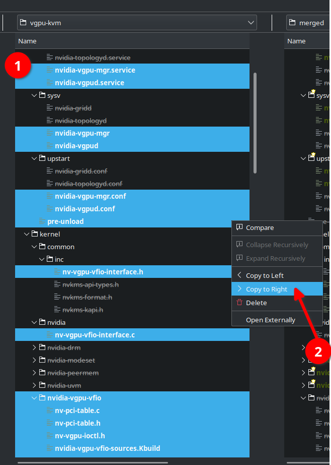

# {{ $frontmatter.title }}

For your system, you may use either use the vGPU-KVM driver or a merged driver, which would supply both DRM (graphics output) and vGPU functions to your host system. Follow directions in either of the sections below, depending on your choice.

Alternatively, if you have a pre-patched driver package, you may skip this page and instead install that package by running the following as root, selecting the correct filename as necessary:

``` sh
bash 'NVIDIA-Linux-x86_64-510.47.03-vgpu-kvm-patched.run' --dkms
```

All directions below assume you have downloaded `NVIDIA-GRID-Linux-KVM-510.47.03-511.65.zip` from NVIDIA's customer portal and have extracted the file into your current working directory. You will additionally need to download <a :href="$withBase('/patches/510.47.03/nvidia-vgpu-vfio.patch')">nvidia-vgpu-vfio.patch</a> and <a :href="$withBase('/patches/510.47.03/nv-kernel.patch')">nv-kernel.patch</a> into the same folder.

## vGPU-KVM Driver

This is the most simple setup, as the only modifications necessary are a small handful of patches and additional source files to support consumer GPUs and [vgpu_unlock-rs](../tools/vgpu-unlock-rs.md).

### Unpack files

``` sh
bash 'NVIDIA-Linux-x86_64-510.47.03-vgpu-kvm.run' -x --target vgpu-kvm
```

### Apply patches

These will allow compilation against Linux 5.15+ and prevent the driver from locking itself out upon detection of a consumer GPU.

``` sh
patch vgpu-kvm/kernel/nvidia-vgpu-vfio/nvidia-vgpu-vfio.c nvidia-vgpu-vfio.patch
patch vgpu-kvm/kernel/nvidia/nv-kernel.o_binary nv-kernel.patch
```

### Add unlock hooks

``` sh
git clone 'https://github.com/DualCoder/vgpu_unlock.git' vgpu_unlock

cp -l vgpu_unlock/kern.ld vgpu-kvm/kernel/nvidia/kern.ld
cp -l vgpu_unlock/vgpu_unlock_hooks.c vgpu-kvm/kernel/nvidia/vgpu_unlock_hooks.c

sed -i '$ a ldflags-y += -T $(src)/nvidia/kern.ld' vgpu-kvm/kernel/nvidia/nvidia.Kbuild
sed -i '32 a #include "vgpu_unlock_hooks.c"' vgpu-kvm/kernel/nvidia/os-interface.c

echo 'kernel/common/inc/vgpu_unlock_hooks.c 0644 KERNEL_MODULE_SRC INHERIT_PATH_DEPTH:1 MODULE:vgpu' >> vgpu-kvm/.manifest
echo 'kernel/nvidia/kern.ld 0644 KERNEL_MODULE_SRC INHERIT_PATH_DEPTH:1 MODULE:resman' >> vgpu-kvm/.manifest
```

### Install

You can either install the driver directly ...

``` sh
vgpu-kvm/nvidia-installer --dkms
```

... or you can re-pack it for ease of safe-keeping (and/or use with applications such as [libvf.io](https://libvf.io/)):

``` sh
vgpu-kvm/makeself.sh --target-os $(uname -s) --target-arch $(uname -m) \
	"vgpu-kvm" \
	"./NVIDIA-Linux-x86_64-510.47.03-vgpu-kvm-patched.run" \
	"NVIDIA Accelerated Graphics Driver for Linux-x86_64 510.47.03 w/ Unlock Hooks" \
	./nvidia-installer
```

## Merged Driver

The more complex of the two approaches, building the merged driver will require more work and possibly some judgement/trial-and-error if not working with the exact release the instructions are written against.

You will, in addition to the previous set of prerequisites, need to install Meld to proceed.

### Unpack files

This expands the Grid and vGPU-KVM driver packages, fixes permissions and creates an intitial copy of the Grid driver to use as a base for the merged driver.

``` sh
bash 'NVIDIA-Linux-x86_64-510.47.03-grid.run' -x --target grid
bash 'NVIDIA-Linux-x86_64-510.47.03-vgpu-kvm.run' -x --target vgpu-kvm

chmod -R u+w .

cp -lR grid merged
```

### Resolve differences in Meld

1. Open Meld and start a new 3-way directory comparison.


2. Ensure you have no filters applied and change the view option to show file status: new


3. Under `vgpu-kvm`, ctrl + click to select all the items listed in green. These are the files present in the vgpu-kvm driver that need to be copied into the merged driver. Then, right click and select "Copy to Right".



4. Update your view options to show file status: modified

5. Take the `post-install`, `pre-uninstall`, `nvidia-sources.Kbuild` and `nvidia-bug-report.sh` from `vgpu-kvm` and copy them to `merged` (as was done in step 5).

::: tip Note

This does leave out the code which installs `nvidia-gridd` and `nvidia-topologyd`, but those appear to be irrelevant on the host.

If that is a concern, you should manually resolve the differences within `post-install` and `pre-uninstall`.

:::

6. Manually edit `merged/conftest.sh` to add the line `VGX_KVM_BUILD=1` just above where the `GRID_BUILD` variable is assigned.


7. Add the lines from `vgpu-kvm` into `merged/.manifest`
- append `nvidia-vgpu-vfio` to line 4 (the list of modules to build)
- take any lines that appear in under `vgpu-kvm/.manifest` as blue or green and copy them to `merged/.manifest` (for blue sections, you can hold ctrl and click the right arrow to get a copy menu)


8. Close Meld, making sure to save changes to the files which were manually edited.

### Apply support patches

``` sh
patch merged/kernel/nvidia-vgpu-vfio/nvidia-vgpu-vfio.c nvidia-vgpu-vfio.patch
patch merged/kernel/nvidia/nv-kernel.o_binary nv-kernel.patch
```

### Add unlock hooks

``` sh
git clone 'https://github.com/DualCoder/vgpu_unlock.git' vgpu_unlock

cp -l vgpu_unlock/kern.ld merged/kernel/nvidia/kern.ld
cp -l vgpu_unlock/vgpu_unlock_hooks.c merged/kernel/nvidia/vgpu_unlock_hooks.c

sed -i '$ a ldflags-y += -T $(src)/nvidia/kern.ld' merged/kernel/nvidia/nvidia.Kbuild
sed -i '32 a #include "vgpu_unlock_hooks.c"' merged/kernel/nvidia/os-interface.c

echo 'kernel/common/inc/vgpu_unlock_hooks.c 0644 KERNEL_MODULE_SRC INHERIT_PATH_DEPTH:1 MODULE:vgpu' >> merged/.manifest
echo 'kernel/nvidia/kern.ld 0644 KERNEL_MODULE_SRC INHERIT_PATH_DEPTH:1 MODULE:resman' >> merged/.manifest
```

### Install

As with the vGPU-KVM driver, you can either install directly (as root) or build a resultant `.run` package.

``` sh
merged/nvidia-installer --dkms
```

``` sh
merged/makeself.sh --target-os $(uname -s) --target-arch $(uname -m) \
	"merged" \
	"./NVIDIA-Linux-x86_64-510.47.03-grid-vgpu-kvm.run" \
	"NVIDIA Accelerated Graphics Driver for Linux-x86_64 510.47.03 (Merged) w/ Unlock Hooks" \
	./nvidia-installer
```
