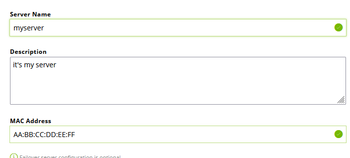
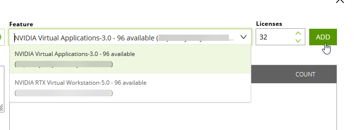
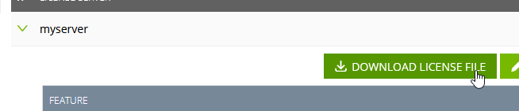
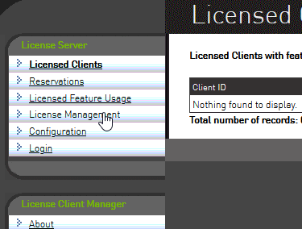
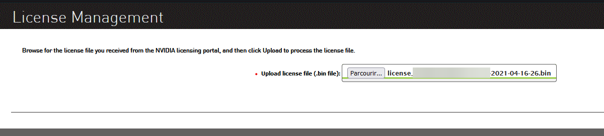

# {{ $frontmatter.title }}

## Disclaimer

NVIDIA provides official documentation and installation instructions for the licensing server application. While basic instructions are provided below, we recommend referring to their materials for this step:

<https://docs.nvidia.com/grid/ls/latest/grid-license-server-user-guide/index.html>

## Installation Instructions

Licensing is essential to the proper function of vGPU technology. It is a licensed product and requires a valid license provided by either NVIDIA or a partner to be used.

To set up the server that hands out licenses to each of the vGPU instances, you’ll start by logging back into the NVIDIA Licensing Portal and visiting the downloads tab. From there, you will be able to select the latest license server application.

::: tip

You don't have to run the licensing server on your vGPU host, so feel free to choose either OS depending on where you want to run the application.

:::

On Windows, setup is very straight-forward with a GUI provided by NVIDIA. You will need Oracle Java software installed in order for the license server to install and function. On Linux, the installer is CLI-based, and you’ll need to install both Java *and Tomcat* web server first. Make sure to install the license server with web access so that you can access it from a separate computer.

In order to use the license server, you’ll need a license file (.bin) which you can obtain from the NVIDIA Licensing Portal. Log back into the Portal, click on the Create server button and fill in details such as the name of your server, a description, and most importantly, the MAC address of the server it is running on.

The name and description can be whatever you like. However, the MAC address must be set to the same MAC address as your main network adapter.

::: tip

Finding the address of the network adapter in the system can be done using ipconfig /all on Windows and ip link on Linux.

:::

You now need to add licenses themselves (features) to your server. There are different types of licenses, and you can add multiple types to one license server file. Different vGPU profiles require a specific license type to use, for example the A-series profiles need a vApps license (see [vGPU Types](../reference/vgpu-types.md) for details).

After you create the license server on the portal, you can download the associated license (.bin) file for use on your server.

Then, connect to your licensing server's web interface (`http://<serverIP>:8080/licserver`), go to the “License Management” section and upload the downloaded license file.

