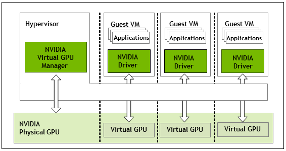

# How does vGPU work?

The technology works by splitting a supported graphics card’s resources amongst multiple VMs (virtual machines). The advantage of this over traditional virtual machines is full graphics acceleration, which is not as feasible with CPU rasterization. Virtual Machines are popular in the datacenter and in VDI scenarios as they are easy to migrate and provision to employees and users. Remote users can connect to a central VDI server to access their own workspace on a “lighter” computer such as a laptop or thin client. Graphical workloads that require an elevated amount of 3D and/or compute power can’t always be run on ultrabooks and other “light” computers.

That would make sense for office and other enterprise environments where graphical power is needed remotely. But what does that mean for you? The goal of `vgpu_unlock` (and its variants) is to permit a user to run Nvidia vGPU technology on inferior graphics cards or consumer variants to the professional datacenter graphics cards designed for vGPU. With this, users can virtualize their own graphics cards for a couple virtual machines.  This could allow a user to run a virtual machine capable of gaming for friends, or use Windows on Linux with graphical acceleration (using Looking Glass) for example. There are certainly more uses out there, but these are just some of the common use cases.

<figure>
  
  <figcaption>vGPU Architecture Overview, credit: NVIDIA</figcaption>
</figure>

Do you need vGPU? Depends. First of all, it’s best to have a good understanding of using Linux and how this technology works before going forth and attempting the setup. If you have a need for graphically accelerated Windows or Linux virtual machines, you may consider vGPU for your environment. There are alternatives that exist for specific cases which we will cover later.

## System Requirements

### Supported Hardware

#### CPU and Motherboard

Virtualization extensions are required; this means Intel's VT-x or AMD's AMD-V must be supported and enabled. Please consult the vendor provided documentation to confirm that your CPU and motherboard have support for virtualization and for the steps to enable it in the BIOS.

::: tip

IOMMU may be necessary for vGPU to work properly on some systems (such as those using Ampere GPUs). If you encounter issues while setting up your system, verify AMD-Vi or Intel VT-d is enabled in your system's firmware.

:::

#### Graphics Cards

| vGPU Certified Card | GPU Chip | Supported Consumer Equivalent  |
|:-------------------:|:--------:| ------------------------------:|
| Tesla M10           | GM107 x4 | Most first-gen Maxwell cards   |
| Tesla M60           | GM204 x2 | Most second-gen Maxwell cards  |
| Tesla P40           | GP102    | Most Pascal cards              |
| Tesla V100 16GB     | GV100    | Titan V & Quadro GV100         |
| Quadro RTX6000      | TU102    | Most Turing cards              |
| RTX A6000           | GA102    | <b>None (don't expect any)</b> |

### Supported Operating Systems

#### Host

* Red Hat Enterprise Linux (Tested w/ Linux 4.18)
  * Certified by Nvidia for production usage of vGPU with certified cards
* Proxmox VE (Tested w/ Linux 5.4)
* Plenty more not listed here.

::: warning

The currently supported vGPU host driver does not natively compile against Linux > 5.9. Patches are available for 5.10+, but may need to be manually applied depending on your installation method.

:::

#### Guest

* Red Hat Enterprise Linux (and variants)
* Debian 20.04 LTS (and variants)
* Windows 8.1+ (including Server)
* Plenty more not listed here.
