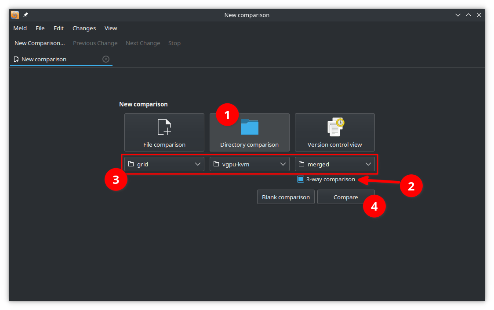
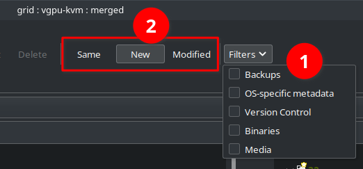
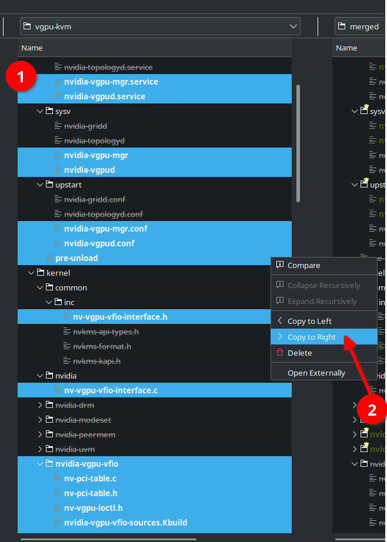
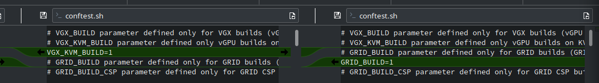
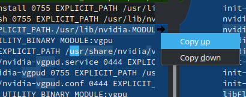

# {{ $frontmatter.title }}

The "merged driver" is a specially re-packed combination of the Grid guest driver and vGPU-KVM host driver to allow the host to access the DRM (local graphics output) functions of the card at the same time as hosting vGPU instances.

There are a number of editions of this floating around for varying versions and with various integrated feature-sets. The directions below will operate on the 510.47.03 release and will integrate hooks necessary for [vgpu_unlock-rs](vgpu-unlock-rs.md) to function.

::: warning

These instructions assume a moderate amount of familiarity working with the drivers (and Linux in general). If you are uncertain about the process, ask around in the Discord.

:::

## Building the Merged Driver

::: tip

Prior to proceeding with building the merged driver, you will need to download `NVIDIA-GRID-Linux-KVM-510.47.03-511.65.zip` from NVIDIA's customer portal.

:::

### Install prerequisites

In order to build the merged driver, you will require `unzip` (or another program which can unpack zip archives), `patch`, `git` and `meld` to be installed.

### Unpack files

This extracts the initial zip file, expands the Grid and vGPU-KVM driver packages, fixes permissions and creates an intitial copy of the Grid driver to use as a base for the merged driver.

If you are using an archive program other than `unzip`, substitute that command as necessary.

``` sh
unzip NVIDIA-GRID-Linux-KVM-510.47.03-511.65.zip -d nvidia-510

cd nvidia-510

bash NVIDIA-Linux-x86_64-510.47.03-grid.run -x --target grid
bash NVIDIA-Linux-x86_64-510.47.03-vgpu-kvm.run -x --target vgpu-kvm

chmod -R u+w .

cp -lR grid merged
```

### Resolve differences in Meld

1. Open Meld and start a new 3-way directory comparison.



2. Ensure you have no filters applied and change the view option to show file status: new



3. Under `vgpu-kvm`, ctrl + click to select all the items listed in green. These are the files present in the vgpu-kvm driver that need to be copied into the merged driver. Then, right click and select "Copy to Right".



4. Update your view options to show file status: modified

5. Take the `post-install`, `pre-uninstall`, `nvidia-sources.Kbuild` and `nvidia-bug-report.sh` from `vgpu-kvm` and copy them to `merged` (as was done in step 5).

::: tip Note

This does leave out the code which installs `nvidia-gridd` and `nvidia-topologyd`, but those appear to be irrelevant on the host.

If that is a concern, you should manually resolve the differences within `post-install` and `pre-uninstall`.

:::

6. Manually edit `merged/conftest.sh` to add the line `VGX_KVM_BUILD=1` just above where the `GRID_BUILD` variable is assigned.



7. Add the lines from `vgpu-kvm` into `merged/.manifest`
- append `nvidia-vgpu-vfio` to line 4 (the list of modules to build)
- take any lines that appear in under `vgpu-kvm/.manifest` as blue or green and copy them to `merged/.manifest` (for blue sections, you can hold ctrl and click the right arrow to get a copy menu)



8. Close Meld, making sure to save changes to the files which were manually edited.

### Apply support patches

These patches are necessary for support on 5.15+ kernels and to stop the driver from locking out consumer cards. You will need to download <a :href="$withBase('/patches/510.47.03/nvidia-vgpu-vfio.patch')">nvidia-vgpu-vfio.patch</a> and <a :href="$withBase('/patches/510.47.03/nv-kernel.patch')">nv-kernel.patch</a> into your current working directory.

``` sh
patch merged/kernel/nvidia-vgpu-vfio/nvidia-vgpu-vfio.c nvidia-vgpu-vfio.patch
patch merged/kernel/nvidia/nv-kernel.o_binary nv-kernel.patch
```

### Add hooks for unlock support

This is optional; if you aren't planning to use [vgpu_unlock-rs](vgpu-unlock-rs.md) or similar, skip this section

``` sh
git clone https://github.com/DualCoder/vgpu_unlock.git vgpu_unlock

cp -l vgpu_unlock/kern.ld merged/kernel/nvidia/kern.ld
cp -l vgpu_unlock/vgpu_unlock_hooks.c merged/kernel/nvidia/vgpu_unlock_hooks.c

sed -i '$ a ldflags-y += -T $(src)/nvidia/kern.ld' merged/kernel/nvidia/nvidia.Kbuild
sed -i '32 a #include "vgpu_unlock_hooks.c"' merged/kernel/nvidia/os-interface.c

echo 'kernel/common/inc/vgpu_unlock_hooks.c 0644 KERNEL_MODULE_SRC INHERIT_PATH_DEPTH:1 MODULE:vgpu' >> merged/.manifest
echo 'kernel/nvidia/kern.ld 0644 KERNEL_MODULE_SRC INHERIT_PATH_DEPTH:1 MODULE:resman' >> merged/.manifest
```

### Create new driver package

This is the last step, and the output file `NVIDIA-Linux-x86_64-510.47.03-grid-vgpu-kvm.run` should be a valid package to install on your system.

``` sh
merged/makeself.sh --target-os $(uname -s) --target-arch $(uname -m) \
	"merged" \
	"./NVIDIA-Linux-x86_64-510.47.03-grid-vgpu-kvm.run" \
	"NVIDIA Accelerated Graphics Driver for Linux-x86_64 510.47.03 (Merged) w/ Unlock Hooks" \
	./nvidia-installer
```
